# RISK version 1 design report
- Yuting Zhang
- Yingcong Fang
- Mingxiang Dai
## Content

- [RISK version 1 design report](#risk-version-1-design-report)
	- [Content](#content)
	- [Main Classes Relation](#main-classes-relation)
	- [Class Design Specifications](#class-design-specifications)
		- [`Client` class](#client-class)
		- [`Communicator` class](#communicator-class)
		- [`Dice` class](#dice-class)
		- [`Game` class](#game-class)
		- [`InputHelper` class](#inputhelper-class)
		- [`Order` class](#order-class)
		- [`OrderCompareHelper` class](#ordercomparehelper-class)
		- [`OrdersList` class](#orderslist-class)
		- [`Player` class](#player-class)
		- [`PlayersInitializer` class](#playersinitializer-class)
		- [`Server` class](#server-class)
		- [`Territory` class](#territory-class)
		- [`ValidOrdersFetcher`class](#validordersfetcherclass)
		- [`World` class](#world-class)
		- [`WorldInitialHelper` class](#worldinitialhelper-class)
	- [Game Sequence Diagram](#game-sequence-diagram)
		- [Server End](#server-end)
		- [Client End](#client-end)

## Main Classes Relation
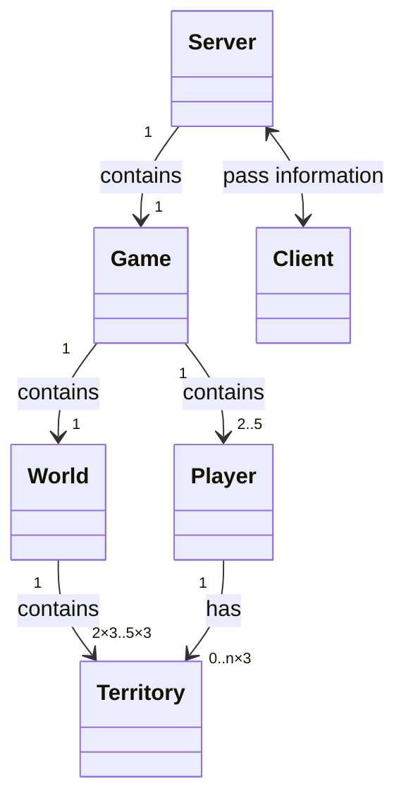
## Class Design Specifications
### `Client` class
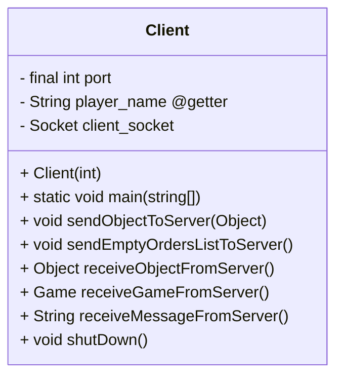
1. Fields:
	- ` private ArrayList<Player> players `: an arraylist of all player objects
2. Methods:
	- `void getRandomPlayer()`: this method should randomly sort the players
	- ` int rollDiceAndGetResult()`: this method should give a random number from 1-20
	- ` public boolean attackerWins()`: this method will use rollDiceAndGetResult() method to judge whether the attack will win or lose after rolling the dice.
### `Communicator` class
1. The `getTheLatestWorld` should be the method that return the world.
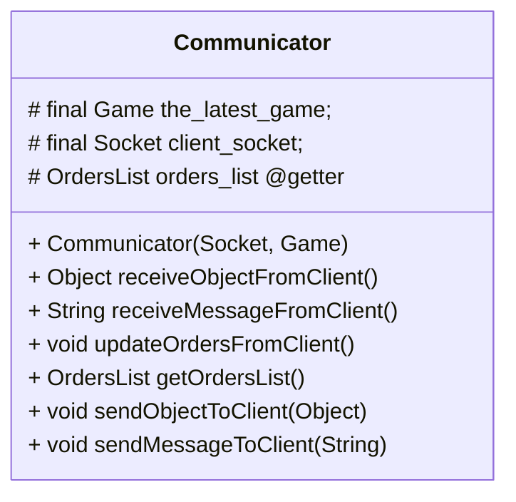
1. Fields:
	- `final Game the_latest_game`: the latest game which will be sent to client.
	- `final Socket client_socket`: the socket of the target client.
	- `OrdersList orders_list`: the orders received form the client.
2. Methods:
	- `Object receiveObjectFromClient()`: this method should keep waiting for client to sent an `Object` and return that object.
	- `String receiveMessageFromClient()`: this method should keep waiting for client to sent an `String` and return that object.
	- `void updateOrdersFromClient()`: This method should cast the object received to an ArrayList of Order and prepare to assign this.player to the player.
	- `void sendObjectToClient(Object)`: This object should take an `Object`  and send this object to the target client.
	- `void sendMessageToClient(String)`: This method will should send a  string to client.

### `Dice` class

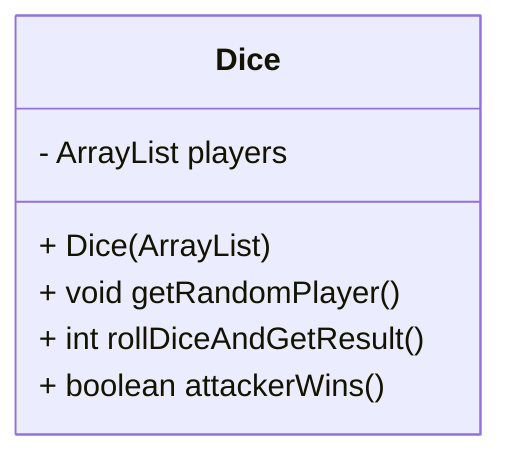
1. Fields:
	- ` private ArrayList<Player> players `: an arraylist of all player objects
2. Methods:
	- `void getRandomPlayer()`: this method should randomly sort the players
	- ` int rollDiceAndGetResult()`: this method should give a random number from 1-20
	- ` public boolean attackerWins()`: this method will use rollDiceAndGetResult() method to judge whether the attack will win or lose after rolling the dice.
### `Game` class
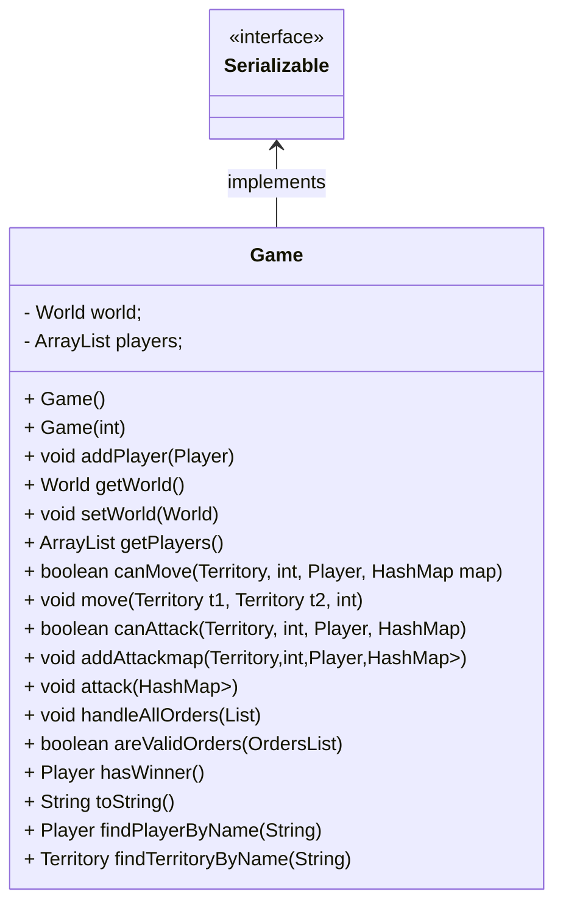
1. Fields:
	- `World world`: the world in this game
	- `ArrayList<Player> players`: all the player objects in arraylist
2. Methods:
	- `void addPlayer(Player)`: this method can add Player in ArrayList players
	- `World getWorld()`: this method will return the world in game
	- `void setWorld(World)`:this method will set world in game
	- `ArrayList<Player> getPlayers()`: this method will return the arraylist of players
	- `boolean canMove(Territory, int, Player, HashMap<Territory, Integer>)`: this method will check the validation of the move by the start place, destination and player who give this order.
	- `void move(Territory, int)`: this method will make the move for the valid order
	- `boolean canAttack(Territory, int, Player, HashMap<Territory, Integer>)`: this method will check the validation of the attack by the start place, destination and player who give this order.
	- `void addAttackmap(Territory,int,Player,HashMap<Player, HashMap<Territory, Integer>>)`: this method will collect the attack into a HashMap.
	- `void attack(HashMap<Player, HashMap<Territory, Integer>>)`: this method will make the attack based on the attackmap.
	- `void handleAllOrders(List<OrdersList>)`: this method will handle all the orderlist from all players in one round.
	- `boolean areValidOrders(OrdersList)`: this method will check the validation of one orderlist. If there is one invalid order in the orderlist, the method will return false.
	- `Player hasWinner()`: this method will return the winner in this game
	- `String toString()`: this method will return the string of this game
	- `Player findPlayerByName(String)`: this method will find the Player object by the input name
	- `Territory findTerritoryByName(String)`: this method will find the territory object by the input name

### `InputHelper` class
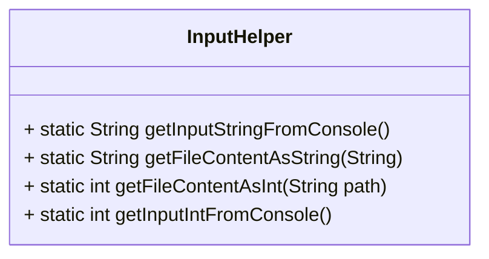
1. Methods: all methods in this class are static methods.
	- `static String getInputStringFromConsole()`: return the input the player type in console as a string.
	- `static String getFileContentAsString(String)`: return the content in a file as a string.
	- `static int getFileContentAsInt(String path)`: return the content in a file as a integer.
	- `static int getInputIntFromConsole()`: return the input the player type in console as a integer.

### `Order` class
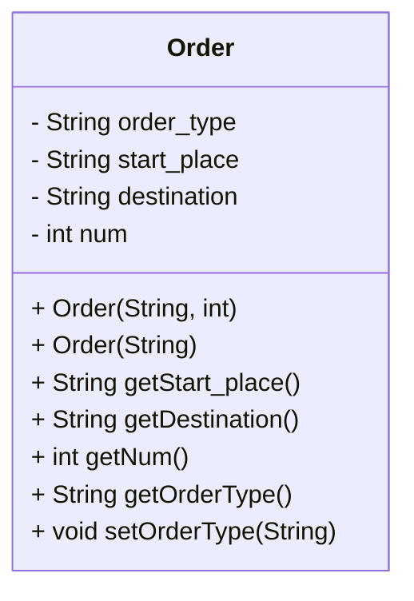
1. Fields:
	-`String order_type`: assign the order type in this string. For now, it is either “attack” or “move”
	-`String start_place`: give the name of start place in this field
	-`String destination`: give the name of destination of this movement in this fielfd
	-`in num`: give the number of units of this movement in this field
2. Methods:
	-`String getStart_place()`: this method will return the name of start place
	-`String getDestination()`:this method will return the name of the destination
	-`int getNum()`: this method will return the unit number of this movement
	-`String getOrderType()`: this method will return the type of this movement
	-`void setOrderType(String)`: this method will set the type of this movement

### `OrderCompareHelper` class
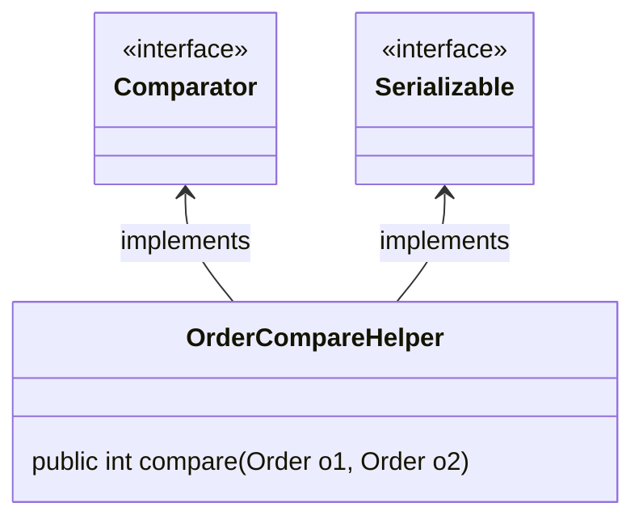
1. Method:
	- `public int compare(Order o1, Order o2)`: compare the order and return negtive number if o1 is smaller than o2, return positive number if o1 is larger than o2, return 0 if they are equal.

### `OrdersList` class
1. The object of this class will be transfer from client to server
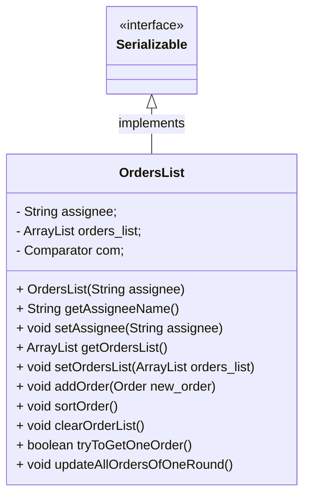
1. Fields:

	- `private String assignee`: the player who give the order list 
	- `private ArrayList<Order> orders_list = new ArrayList<>()`: the order list containing all order  one round for one player
	-  `private Comparator com`: the comparator will be used to compare the order

2. Methods:
	-  `public OrdersList(String assignee)`: initailize the order list
	-  `public String getAssigneeName()`: return the assignnee name of the order
	- ` public void setAssignee(String assignee)`: set the assignee of the order
	-  `public ArrayList<Order> getOrdersList()`: return the order list
	- ` public void setOrdersList(ArrayList<Order> orders_list)`: set the order list
	-  `public void addOrder(Order new_order)`: add one order to the order list
	-  ` public void sortOrder()`: sort the order to make all move happens before attack order
	-  `public void clearOrderList()`: clear the order list to make it empty for next round
	-  `public boolean tryToGetOneOrder()`: get one order from assignee
	-  `public void updateAllOrdersOfOneRound()`: update all order for one round

### `Player` class
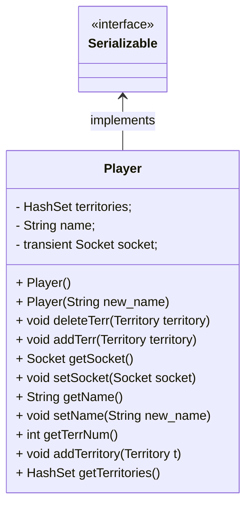
1. Fields:
	- `HashSet<Territory> territories`: the territories belong to this player
	- `private String name`: the name of the player
	- `private transient Socket socket`: the socket of the player to comunicate with server

2. Methods:
	- `public Player()`: the constructor of the player takes no parameter
	- `public Player(String new_name)`: the constructor of the player takes one parameter - the name of the player
	- `public void deleteTerr(Territory territory)`: delete specific territory
	- `public void addTerr(Territory territory)`: add one territory
	- `public Socket getSocket()` : return the socket of the player
	- `public void setSocket(Socket socket)` : set the socket of the player
	- ` public String getName()` : return the name of the player
	- `public void setName(String new_name)`: set the name of the player
	- `public int getTerrNum()` :  return how many territories the player has
	- `public void addTerritory(Territory t)` : add one territory to the player's land
	-` public HashSet<Territory> getTerritories() `:  return all territories belong to the player
	
### `PlayersInitializer` class
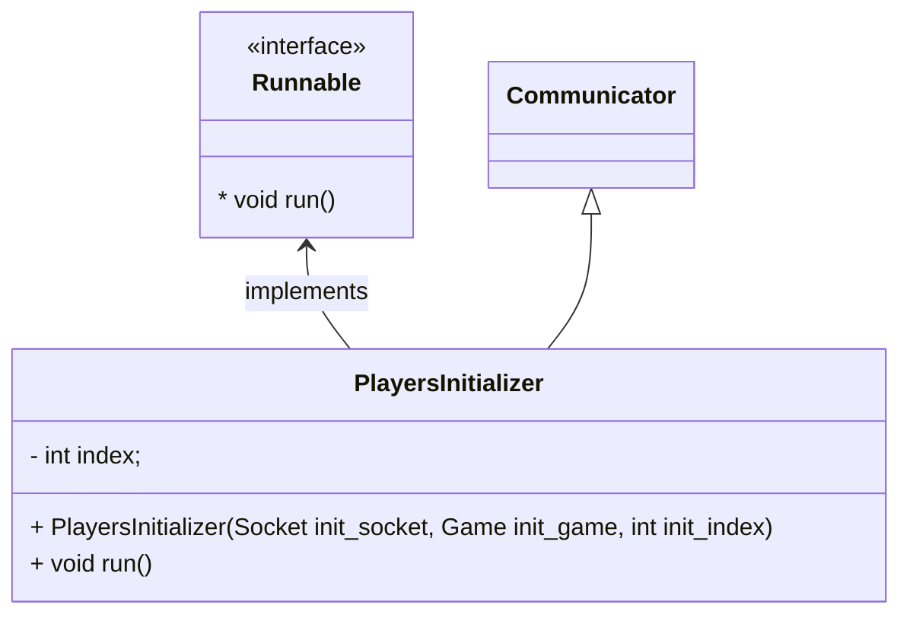

1. Fields:
	- `int index`: the index of current thread.
2. Methods:
	- `PlayersInitializer(Socket init_socket, Game init_game, int init_index)`: the constructor
	- `void run()`: the main function of current thread, which should  wait a client connet to the server and initialize player.

### `Server` class
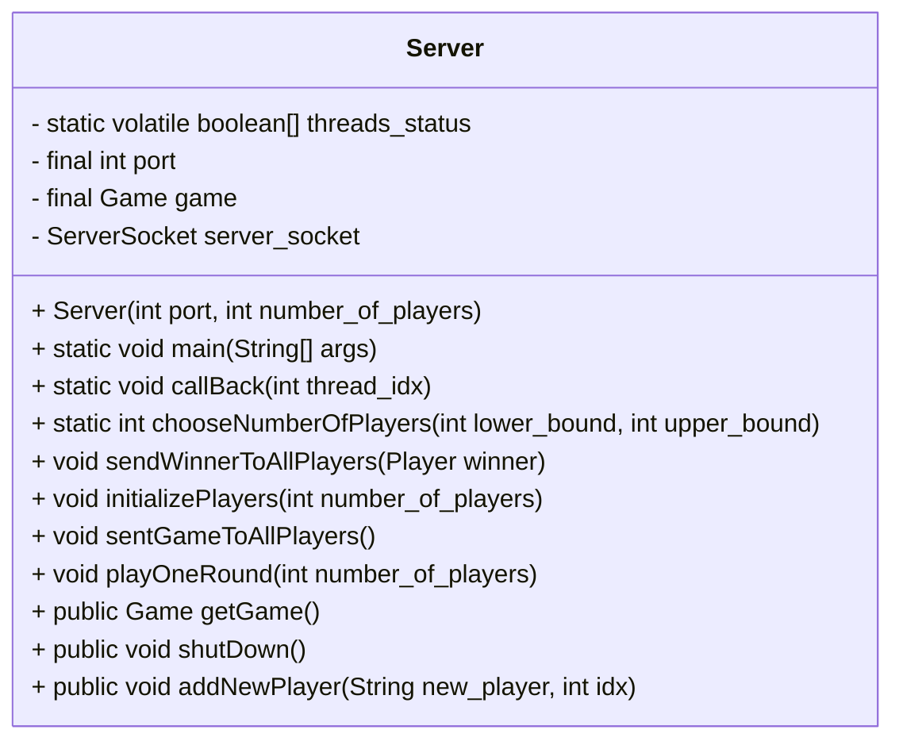
1. Fields:
	- `static volatile boolean[] threads_status`: this field server as flags for call back function.
	- `final int port`:  port number.
	- `final Game game`: the game.
	- `ServerSocket server_socket`: server end socket
2. Methods:
	- `Server(int port, int number_of_players)`: the constructor.
	- `static void main(String[] args)`: the main function of server end.
	- `static void callBack(int thread_idx)`: the called back funciton which should tell master thread the data is ready to be read.
	- `static int chooseNumberOfPlayers(int lower_bound, int upper_bound)`: when initialize the game, this method should be called and asked players how many players will be in the game.
	- `void sendWinnerToAllPlayers(Player winner)`: in the end of the game, this method will send message to players to let them know who is the winner
	- `void initializePlayers(int number_of_players)`: this method will wait for some players connecting to server and add them to game.
	- `void sentGameToAllPlayers()`: in the end of each round, this method will send the latest game to client.
	- `void playOneRound(int number_of_players)`: the core method in Server class. This method is responsible for control the work flow of the game,
	- `public Game getGame()`: the getter of game.
	- `public void shutDown()`: this method will close the server_socket.
	- `public void addNewPlayer(String new_player, int idx)`: this method will add a new player to the game.

### `Territory` class
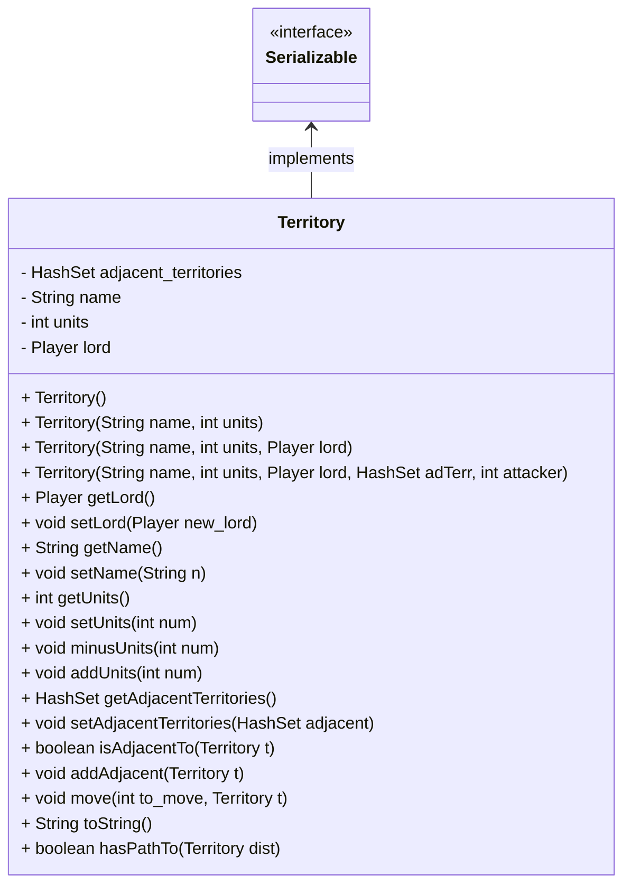
1. Fields:
	- `private HashSet<Territory> adjacent_territories`:
	- `private String name`:
	- `private int units`:
	- `private Player lord`:

2. Methods:
	- `public Territory() `: default constructor 
	- `public Territory(String name, int units)`: constructor takes parameters of the territory name and the units of the territory
	- `public Territory(String name, int units, Player lord)`: constructor takes name, units and the lord of this land
	- `public Territory(String name, int units, Player lord, HashSet<Territory> adTerr, int attacker)`: constructor sets all parameters
	- `public Player getLord()`: return the lord of the land
	- `public void setLord(Player new_lord)`: set the lord of the land
	- `public String getName() `: return the name of the territory
	- `public void setName(String n)`: set the name of the territory
	- `public int getUnits()`: return the unites of the land
	- `public void setUnits(int num)`: set the unites of the land
	- `public void minusUnits(int num)`: decrease the unit of the land by num
	- `public void addUnits(int num)`: increase the unit of the land by num
	- `public HashSet<Territory> getAdjacentTerritories()`: return adjacent territories of this land
	- `public void setAdjacentTerritories(HashSet<Territory> adjacent)`: set adjacent territories of this land
	- `public boolean isAdjacentTo(Territory t) `: check if a territory is adjacent to this land
	- `public void addAdjacent(Territory t) `: add one adjacent territory to this land
	- `public void move(int to_move, Territory t) `:  move some unites to another territory, move command use this function
	- `public String toString() `: return description of the territory
	- `public boolean hasPathTo(Territory dist) `: check if there is a path bettween this land and another territory

### `ValidOrdersFetcher`class
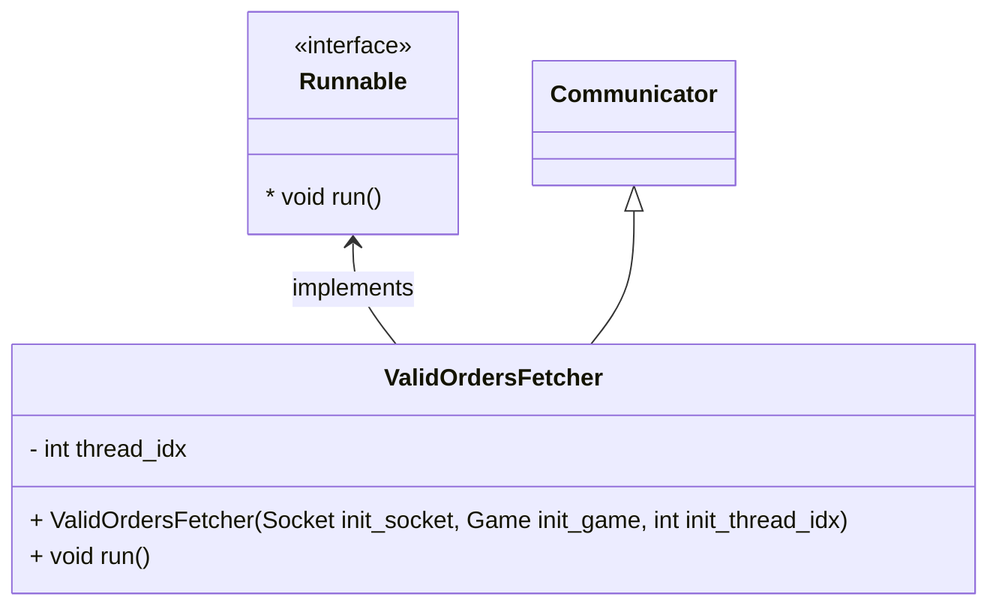
1. Fields:
	- `int index`: the index of current thread.
2. Methods:
	- `ValidOrdersFetcher(Socket init_socket, Game init_game, int init_index)`: the constructor
	- `void run()`: the main function of current thread, which should be an infinite loop until player input a valid order.

### `World` class
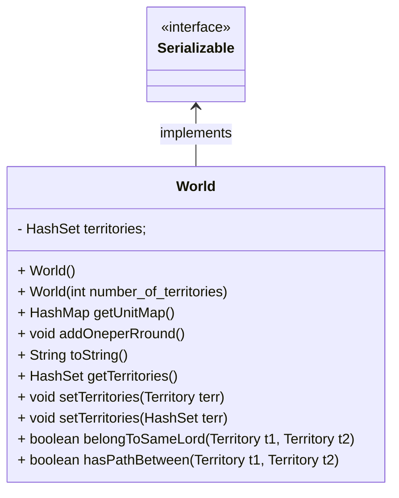
1. Fields:
	- `HashSet<Territory> territories`: the territory list of the world

2. Methods:
	-  `public World()`: constructor of the world
	- `public World(int number_of_territories)`: constructor takes parameter to indicates how many territories the world has
	- `public HashMap<Territory, Integer> getUnitMap()`: return map of territories and its unit
	- `public void addOneperRround()`: add one unit on territories at the end of each round
	- `public String toString()`: return description of the world
	- `public HashSet<Territory> getTerritories()`: return territories of the world
	- `public void setTerritories(Territory terr)`: add one territory 
	- `public void setTerritories(HashSet<Territory> terr)`: set territories of the world
	- `public boolean belongToSameLord(Territory t1, Territory t2)`: check if two territoryes belong to same lord
	- `public boolean hasPathBetween(Territory t1, Territory t2)`: check if there is one path between two territories
### `WorldInitialHelper` class
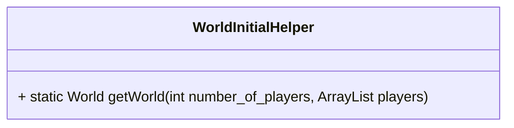
1. Method:
	- `public static World getWorld(int number_of_players, ArrayList<Player> players)`: return the initilization of the world according to how many players play the game.

## Game Sequence Diagram
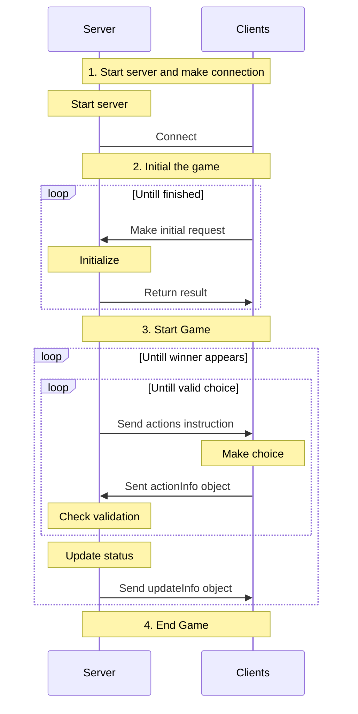
### Server End
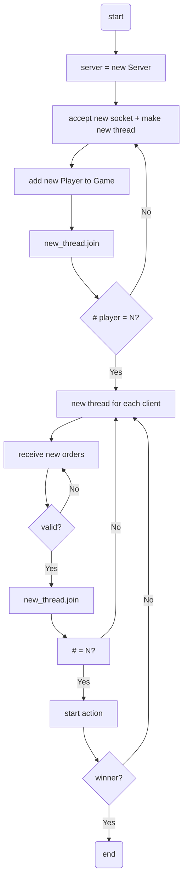

### Client End

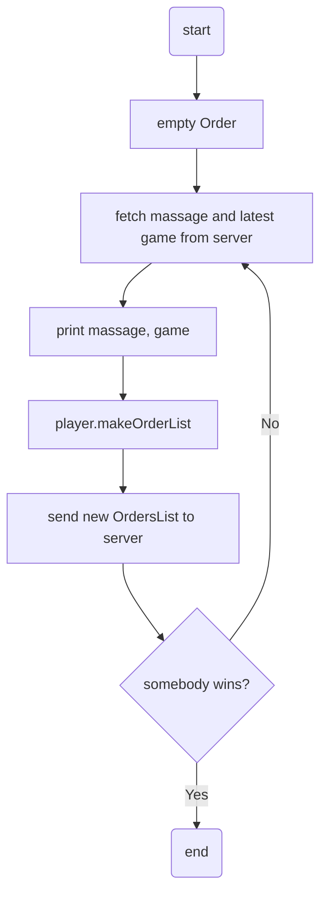

