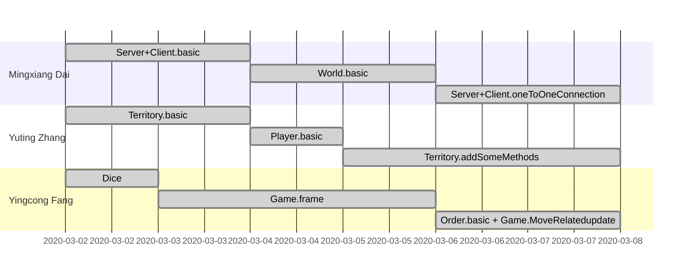
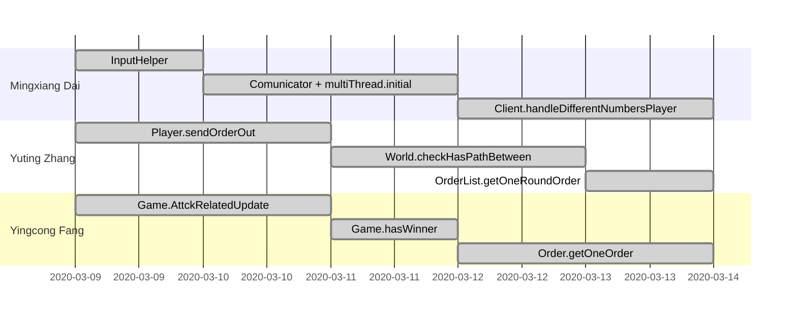
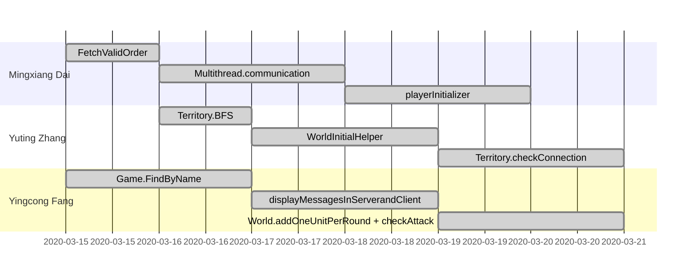

# Sprint Planning
## Sprint 1
- Deadline: 2020-3-8
- Manager: Yuting Zhang

## Sprint 2

- Deadline: 2020-3-14
- Manager: Yingcong Fang

## Sprint 3

- Deadline: 2020-3-21
- Manager: Mingxiang Dai

